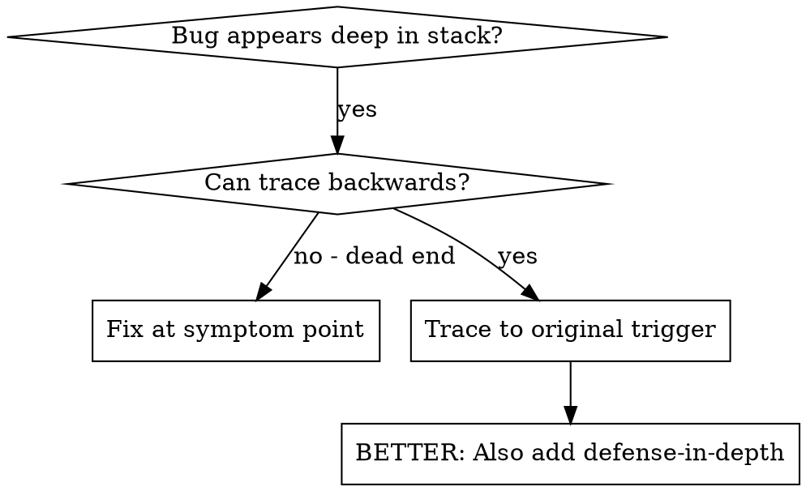
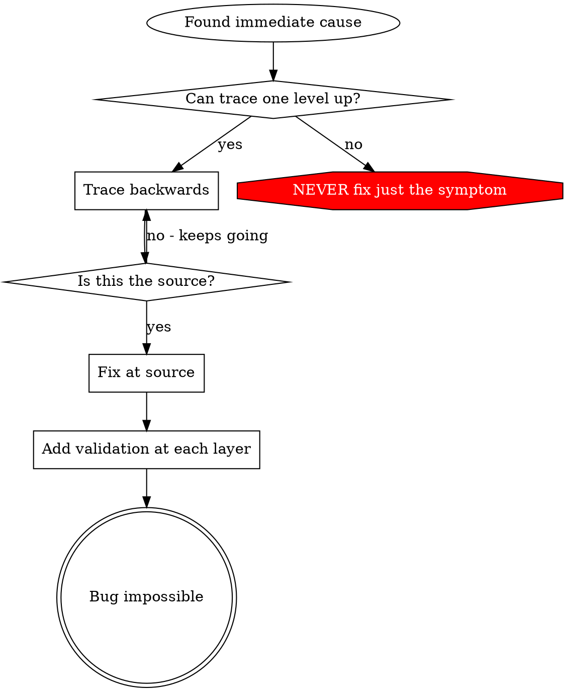

# Root Cause Tracing

## Overview

Bugs often manifest deep in the call stack (git init in wrong directory, file
created in wrong location, database opened with wrong path). Your instinct is to
fix where the error appears, but that's treating a symptom.

**Core principle:** Trace backward through the call chain until you find the
original trigger, then fix at the source.

## When to Use



**Use when:**

- Error happens deep in execution (not at entry point)
- Stack trace shows long call chain
- Unclear where invalid data originated
- Need to find which test/code triggers the problem

## Search Tool Preference

**Use LSP tools for tracing call chains:**

| Task                          | Tool                          |
| ----------------------------- | ----------------------------- |
| Find function definition      | `mcp__cclsp__find_definition` |
| Find what calls this function | `mcp__cclsp__incomingCalls`   |
| Find all references           | `mcp__cclsp__find_references` |
| Trace outgoing calls          | `mcp__cclsp__outgoingCalls`   |

**LSP is essential for backward tracing** - it accurately finds callers across
the codebase, handles inheritance and aliases.

**Use Grep tool (not bash grep) for log/output searches:**

| Task                | Grep Tool Call                                       |
| ------------------- | ---------------------------------------------------- | ------------------------------------- |
| Find debug output   | `Grep(pattern, path, output_mode: "content", -C: 3)` |
| Find error messages | `Grep("ERROR\\                                       | WARN", path, output_mode: "content")` |

## Approach Options

**Option 1: Manual Tracing (This Skill)**

- Manual backward tracing through call stack
- Add instrumentation where needed
- Flexible, good for understanding code flow
- Follow "The Tracing Process" below

**Option 2: Systematic Audit (Alternative)**

```
Skill: search-code

Trace call stack using call-stack-tracing.md checklist.

For systematic, checklist-based approach. See superpowers:systematic-debugging for details.
```

**Use manual tracing (this skill) when:**

- Learning unfamiliar code
- Complex inter-system bugs
- Need flexibility in investigation

**Use systematic audit when:**

- Want structured checklist
- Need LSP-based navigation
- Prefer hierarchical drill-down

## The Tracing Process

### 1. Observe the Symptom

```
Error: git init failed in /Users/jesse/project/packages/core
```

### 2. Find Immediate Cause

**What code directly causes this?**

```typescript
await execFileAsync('git', ['init'], { cwd: projectDir });
```

### 3. Ask: What Called This?

```typescript
DatabaseClient.executeQuery(userId, options)
  → called by ProjectService.findByUser()
  → called by UserController.getProjects()
  → called by test at API.get('/projects')
```

### 4. Keep Tracing Up

**What value was passed?**

- `projectDir = ''` (empty string!)
- Empty string as `cwd` resolves to `process.cwd()`
- That's the source code directory!

### 5. Find Original Trigger

**Where did empty string come from?**

```typescript
const context = setupCoreTest(); // Returns { tempDir: '' }
Project.create('name', context.tempDir); // Accessed before beforeEach!
```

## Adding Stack Traces

When you can't trace manually, add instrumentation:

```typescript
// Before the problematic operation
async function gitInit(directory: string) {
  const stack = new Error().stack;
  console.error('DEBUG git init:', {
    directory,
    cwd: process.cwd(),
    nodeEnv: process.env.NODE_ENV,
    stack,
  });

  await execFileAsync('git', ['init'], { cwd: directory });
}
```

**Critical:** Use `console.error()` in tests (not logger - may not show)

**Run and capture:**

```bash
npm test 2>&1 | grep 'DEBUG git init'
```

**Analyze stack traces:**

- Look for test file names
- Find the line number triggering the call
- Identify the pattern (same test? same parameter?)

## Finding Which Test Causes Pollution

If something appears during tests but you don't know which test:

Use the bisection script: @find-polluter.sh

```bash
./find-polluter.sh '.git' 'src/**/*.test.ts'
```

Runs tests one-by-one, stops at first polluter. See script for usage.

## Real Example: Empty userId

**Symptom:** Database query returns all user records instead of filtered results

**Trace chain:**

1. `WHERE userId = ''` matches NULL values ← empty filter parameter
2. DatabaseClient called with empty userId
3. ProjectService.findByUser() passed empty string
4. Test accessed `context.currentUser.id` before authentication
5. setupAuthTest() returns `{ currentUser: { id: '' } }` initially

**Root cause:** Top-level variable initialization accessing empty value

**Fix:** Made currentUser a getter that throws if accessed before authentication

**Also added defense-in-depth:**

- Layer 1: UserController validates userId is valid UUID
- Layer 2: ProjectService validates userId not empty
- Layer 3: NODE_ENV guard refuses empty string filters in tests
- Layer 4: Query parameter logging before database execution

## Key Principle



**NEVER fix just where the error appears.** Trace back to find the original
trigger.

## Stack Trace Tips

**In tests:** Use `console.error()` not logger - logger may be suppressed
**Before operation:** Log before the dangerous operation, not after it fails
**Include context:** Directory, cwd, environment variables, timestamps **Capture
stack:** `new Error().stack` shows complete call chain

## Real-World Impact

From debugging session (2025-10-03):

- Found root cause through 5-level trace
- Fixed at source (getter validation)
- Added 4 layers of defense
- 1847 tests passed, zero pollution
