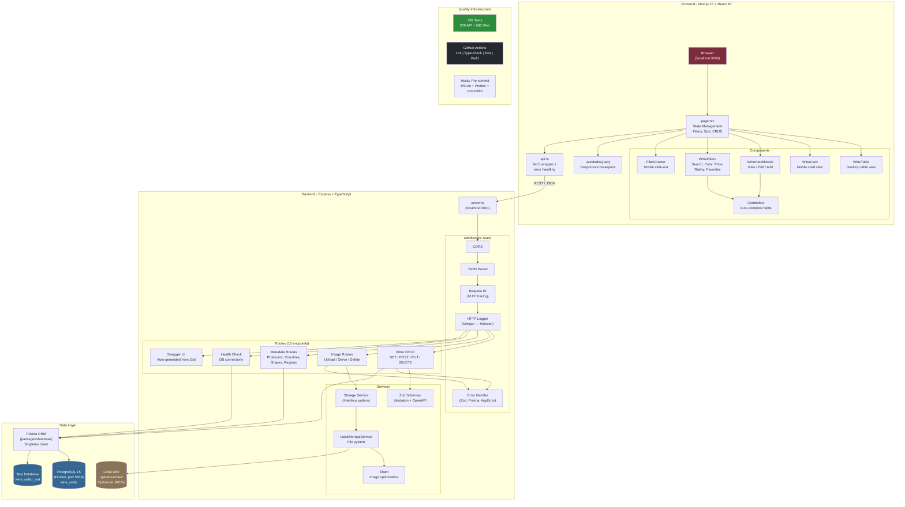
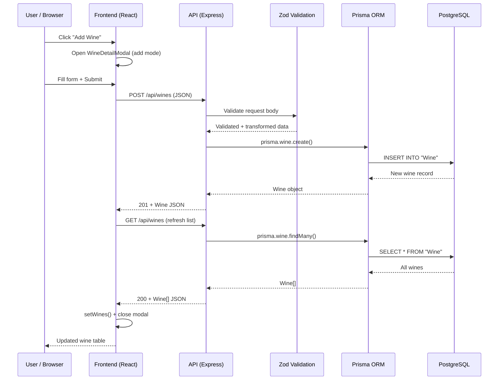
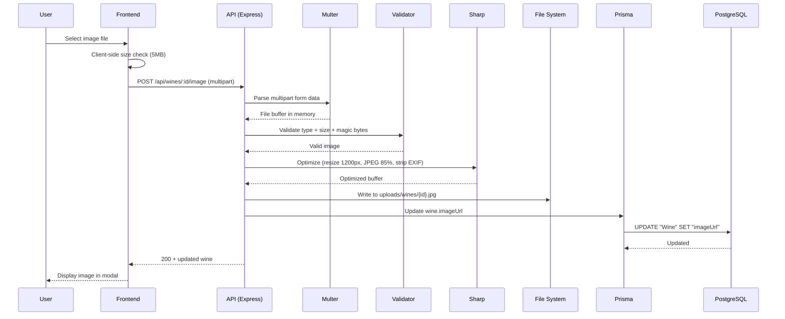
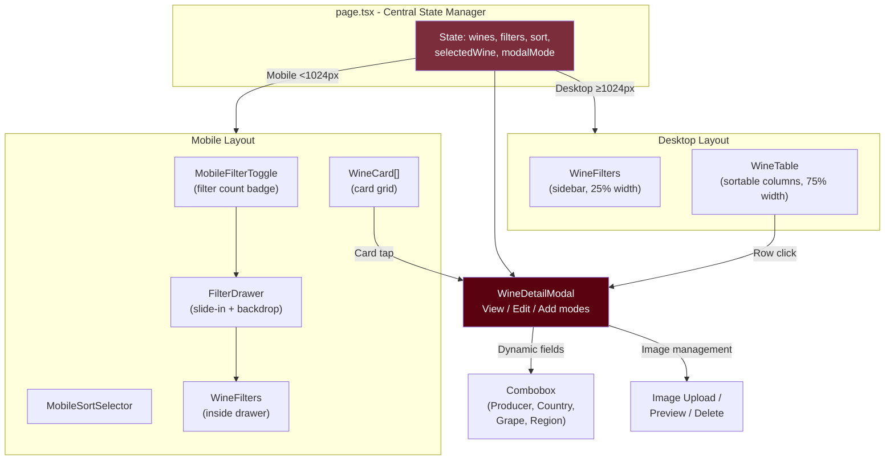
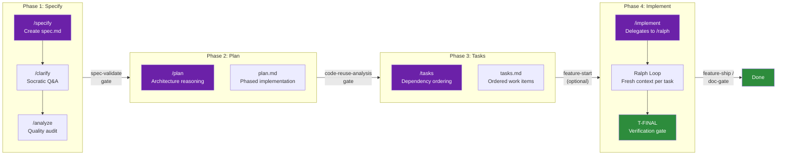
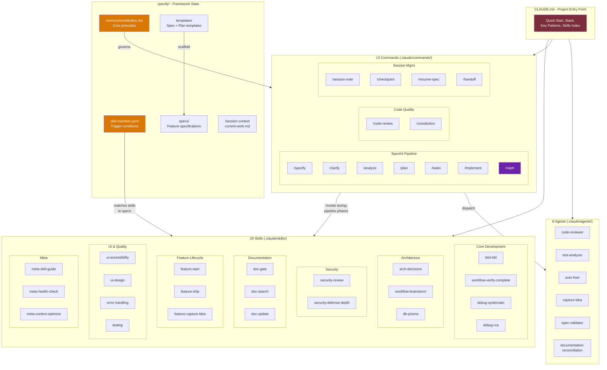
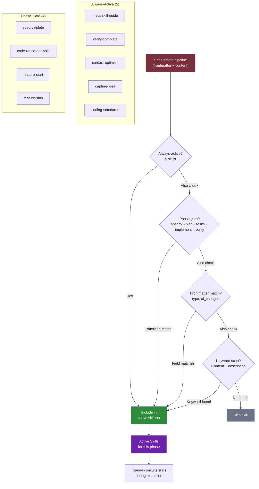
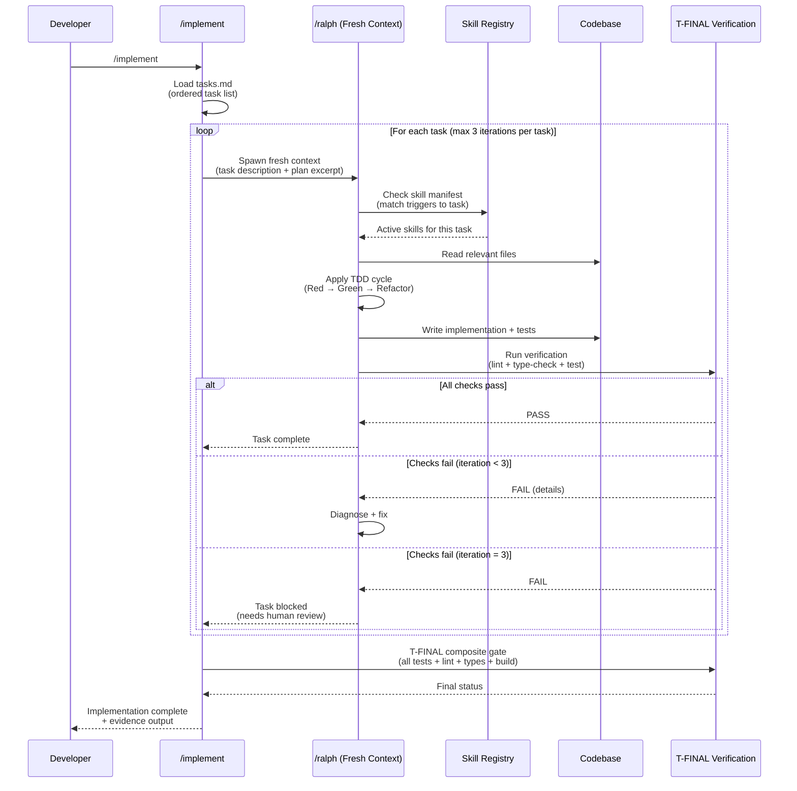

# Wine Cellar - Architecture Diagram

Render this Mermaid diagram at https://mermaid.live or in any Mermaid-compatible
tool (GitHub, Notion, Obsidian, VS Code preview, etc.)

## System Architecture

## Data Flow - Wine CRUD

## Data Flow - Image Upload

## Component Architecture

---

## SpecKit Framework - Pipeline Flow

## SpecKit Framework - Component Architecture

## SpecKit Framework - Skill Matching

## SpecKit Framework - Ralph Loop (Task Execution)

